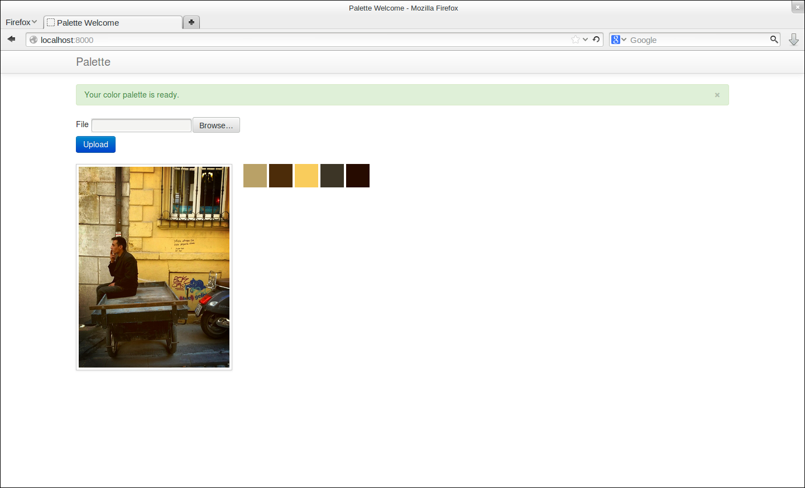

A simple palette application that is written in Python. If you deal with 
this project and have an idea, please contact me or fork it or open an issue.
Thanks.

Usage
-----
Create your Python virtual environment and install dependencies::

    $ pip install -r requirements/development.txt

Then run tornado server::

    $ fab server

That's it.

